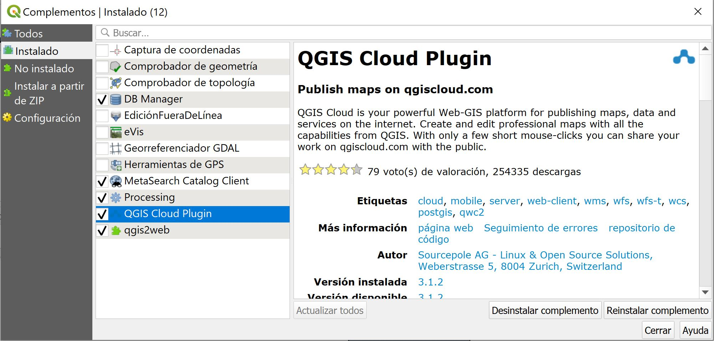
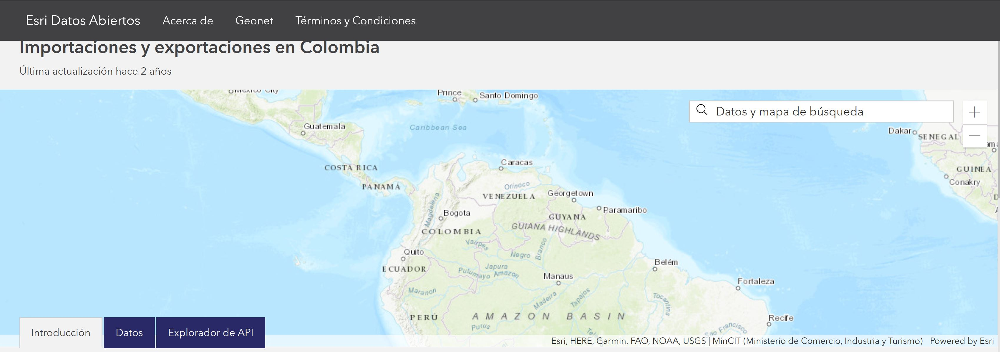

## Cuál es el problema a tratar?

Las exportaciones son el envío de un producto o servicio a otra parte del mundo fuera de las fronteras nacionales, con el propósito de venderlo o intercambiarlo, es decir, con propósitos comerciales.

Las exportaciones dentro de un nivel macroeconómico generan un resultado positivo

## Por qué un mapa ayuda a resolverlo?

Para tener una vision global y enfocarse en productores secctorizados regionales los datos presentados son información sobre el comportamiento del comercio exterior, enfocados en exportaciones para los años de 2012 y 2014 por departamento en Colombia, se visualizara en porcentaje el incremento o detrimento en las exportaciones segun el ultimo año. Las cifras están expresadas en miles de dólares.

En el __mapa 1__ se visualiza una mejor representacion dando a conocer el porcentage de perdida o ganancia segun el año de comparacion perteneciente al 2014, con una distribucion uniforme con respecto al __mapa 2__.

## Fuente de datos

Esri Datos Abiertos http://datosabiertos.esri.co/datasets/importaciones-y-exportaciones-en-colombia

Los datos contenidos fueron consultados directamente de la página del MinCIT (Ministerio de Comercio, Industria y Turismo), www.mincit.gov.co el 31 de marzo de 2015.

## Herramientas

* QGis 
* Qgiscloud

## Proceso Realizado
1. Inicialmente se crea una cuenta en QgisCloud https://qgiscloud.com/

2. En Qgis se instala el complemento Qgis2web

2. Se descarga la informacion de Esri Datos Abiertos 

3. Lo incorrporamos en el proyecto de Qgis llamado mapa 1.qgs

4. Se crea un nuevo campo para comparar las exportaciones hechas entre el 2012 y 2014 por departamento

### Urls

* mapa 1: https://qgiscloud.com/hectorcas85/mapa1/
* mapa 1 WMS: https://wms.qgiscloud.com/hectorcas85/mapa1/
* mapa 2: https://qgiscloud.com/hectorcas85/mapa2/
* mapa 2 WMS: https://wms.qgiscloud.com/hectorcas85/mapa2/
