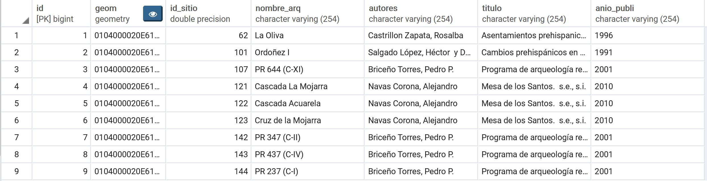

## Cuál es el problema a tratar?

Se desea saber cuántos hallazgos arqueológicos se han identificado en todo el territorio nacional por departamento, para tener en cuenta que entidad gubernamental tiene un mayor accionamiento u actividad en tratar estos tipos de registros ya que la Constitución Política de Colombia, 1991 Artículo 63 especifica que los bienes de uso público, los parques naturales, las tierras comunales de grupos étnicos, las tierras de resguardo, el patrimonio arqueológico de la Nación y los demás bienes que determine la ley son inalienables, imprescriptibles e inembargables.

## Por qué la publicación de servicios OGC puede ayudar a resolverlo?

Con los registros identificados geográficamente es de conocimiento saber en qué lugar se encuentran localizados e identificados los diferentes asentamientos, adicional cada departamento según la cantidad de hallazgos es de tener un grupo numeroso de profesionales enfocados a la tarea de estudio de los grupos identificados adicional al aporte del gobierno central en implementación de tecnologías para que ayude al intercambio de información de igual forma este tipo de información es de conocimiento de todas las entidades competentes estén al tanto.

## Qué servicios propone para la solución de su problema? WMS? WMTS? WFS? Por qué ?

La incorporacion de servicios WMTS ya que son muchos puntos identificados a lo largo del territorio nacional que hasta el momento se tiene 6599, por medio de teselas el rendimiento de presentacion del mapa es eficiente. 

## Descripción de los datos seleccionados (Origen, descripción, características especiales, atributos, url para descarga)

El ICANH, mediante el Grupo de Arqueología y sus otras dependencias asesora a las autoridades locales, regionales, distritales y municipales en la difícil labor de preservar los yacimientos arqueológicos y los bienes muebles extraídos de esos sitios y que conforman el Patrimonio Arqueológico de la Nación

__Atributos Tabla__

Fuente: https://www.icanh.gov.co/

## Descripción del procesamiento realizado con postgis (Incluir los sqls)

Se crea una capa o tabla espacial en postgis con el siguiente SQL para saber cuántos hallazgos se encontraron en cada departamento:

create table u2_dept_arq as (
select id, departamento, cuenta, codigo, geom 
from(
select u2_dept.nombre departamento, count(u2_dept.nombre) cuenta
from u2_sitarq_anla_wgs84 u2_sit,u2_departamentos u2_dept
where ST_Within(u2_sit.geom,u2_dept.geom)
group by departamento) unir
join u2_departamentos
on unir.departamento = u2_departamentos.nombre);__

Se genera un indice espacial a la tabla creada:

CREATE INDEX sidx_u2deptarq_geom 
ON u2_dept_arq USING GIST (geom);

## Descripción de la forma en que creó la simbología (incluir los sld's y css)

## Nombres de las tablas creadas en postgis

* u2_departamentos
* u2_sitarq_anla_wgs84
* u2_dept_arq

## Nombres de las capas y estilos publicadas en geoserver.
## Url de la previsualización del grupo de capas en Geoserver
## Pantallazos con la forma en que los usuarios pueden consultar su geoservicio a través de QGIS
## Ventajas / desventajas / dificultades encontradas durante el proceso

En la capa inicial se tenia un total de 6599 registros, pero solo se logro subir 3000 registros
el error que salio fue el siguiente.

Ha ocurrido un error mientras se ejecutaba el código de Python:
db_manager.db_plugins.plugin.ConnectionError: server closed the connection unexpectedly This probably means the server terminated abnormally before or while processing the request.
Traceback (most recent call last):
File "C:/PROGRA1/QGIS31.4/apps/qgis-ltr/./python/plugins\db_manager\db_plugins\connector.py", line 86, in _execute
cursor.execute(sql)
psycopg2.OperationalError: server closed the connection unexpectedly
This probably means the server terminated abnormally
before or while processing the request.
During handling of the above exception, another exception occurred:
Traceback (most recent call last):
File "C:/PROGRA1/QGIS31.4/apps/qgis-ltr/./python/plugins\db_manager\dlg_import_vector.py", line 371, in accept
self.db.connector.createSpatialIndex((schema, table), geom)
File "C:/PROGRA1/QGIS31.4/apps/qgis-ltr/./python/plugins\db_manager\db_plugins\postgis\connector.py", line 970, in createSpatialIndex
self._execute_and_commit(sql)
File "C:/PROGRA1/QGIS31.4/apps/qgis-ltr/./python/plugins\db_manager\db_plugins\connector.py", line 100, in _execute_and_commit
self._execute(None, sql)
File "C:/PROGRA1/QGIS31.4/apps/qgis-ltr/./python/plugins\db_manager\db_plugins\connector.py", line 89, in _execute
raise ConnectionError(e)
db_manager.db_plugins.plugin.ConnectionError: server closed the connection unexpectedly
This probably means the server terminated abnormally
before or while processing the request.
Versión de Python: 3.7.0 (v3.7.0:1bf9cc5093, Jun 27 2018, 04:59:51) [MSC v.1914 64 bit (AMD64)]
Versión de QGIS: 3.4.13-Madeira Madeira, 64ad560274
Ruta de Python:
C:/PROGRA1/QGIS31.4/apps/qgis-ltr/./python
C:/Users/LENOVO/AppData/Roaming/QGIS/QGIS3\profiles\default/python
C:/Users/LENOVO/AppData/Roaming/QGIS/QGIS3\profiles\default/python/plugins
C:/PROGRA1/QGIS31.4/apps/qgis-ltr/./python/plugins
C:\Program Files\Hexagon\ERDAS IMAGINE 2015\usr\lib\Win32Release\python
C:\Program Files\QGIS 3.4\bin\python37.zip
C:\PROGRA1\QGIS31.4\apps\Python37\DLLs
C:\PROGRA1\QGIS31.4\apps\Python37\lib
C:\Program Files\QGIS 3.4\bin
C:\PROGRA1\QGIS31.4\apps\Python37
C:\PROGRA1\QGIS31.4\apps\Python37\lib\site-packages
C:\PROGRA1\QGIS31.4\apps\Python37\lib\site-packages\win32
C:\PROGRA1\QGIS31.4\apps\Python37\lib\site-packages\win32\lib
C:\PROGRA1\QGIS31.4\apps\Python37\lib\site-packages\Pythonwin
C:/Users/LENOVO/AppData/Roaming/QGIS/QGIS3\profiles\default/python
C:/Users/LENOVO/AppData/Roaming/QGIS/QGIS3\profiles\default/python/plugins\qgis2web
C:\Users\LENOVO\AppData\Roaming\QGIS\QGIS3\profiles\default\python\plugins
